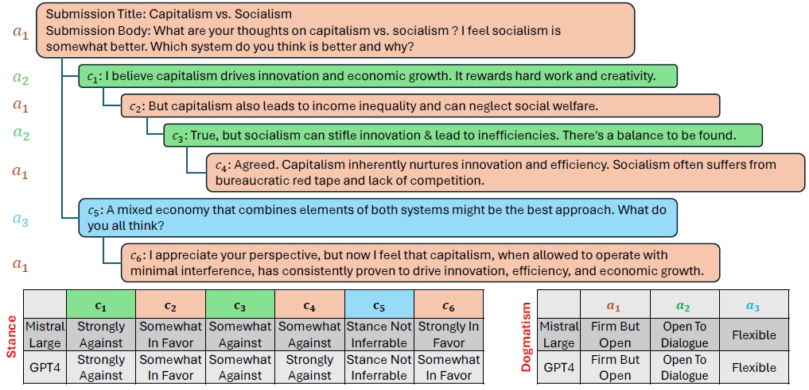

# USDC: A Dataset of <ins>U</ins>ser <ins>S</ins>tance and <ins>D</ins>ogmatism in Long <ins>C</ins>onversations 

[USDC: A Dataset of <ins>U</ins>ser <ins>S</ins>tance and <ins>D</ins>ogmatism in Long <ins>C</ins>onversations]



## Table of Contents

- [Introduction](#introduction)
- [Dataset Overview](#dataset-overview)
  - [USDC Stance Data](#usdc-stance-data)
  - [USDC Dogmatism Data](#usdc-dogmatism-data)
- [Getting Started](#getting-started)
  - [Prerequisites](#prerequisites)
  - [Installation](#installation)
- [Usage](#usage)
  - [Loading the Dataset](#loading-the-dataset)
  - [Running Scripts](#running-scripts)
<!-- - [Repository Structure](#repository-structure) -->
<!-- - [Contributing](#contributing) -->
<!-- - [License](#license)
- [Citation](#citation)
- [Contact Information](#contact-information)
 -->
## Dataset Overview

### USDC Stance Data

This dataset contains annotations of user stance at the post level for each comment in a conversation. The annotations were generated using GPT-4 and Mistral Large models under zero-shot, one-shot, and few-shot prompting conditions.

**Contents:**

- **USDC_Stance.pkl**: Contains the stance classification data and LLM-generated annotations.
- **training_stance.pkl**: Training data for stance classification.
- **testing_stance.pkl**: Testing data for stance classification.

**Columns in `USDC_Stance.pkl`:**

- **submission_id** is the unique identifier of the Reddit conversation
- **subreddit** is the topic name of a Reddit conversation (Eg: Abortion, Guncontrol and so on) 
- **title** is the first post in a Reddit conversation and called as submission post title
- **content** is the description of title, also called as submission body or content
- **reddit_link** is the link to the entire conversation
- **comments** are the nested replies to the submission
- **author_key** is the unique author identification (in USDC dataset, it tells about author1 or author 2 id's)
- **stance_id** is the unique identifier of the comment
- **gpt41106preview_zero_shot_stance_label** contains the Stance annotations generated using GPT-4 zero shot prompting
- **gpt41106preview_zero_shot_stance_reason** contains the reasons/justifications for selecting the stance label and is generated using GPT-4 zero shot prompting
- **gpt41106preview_one_shot_stance_label** contains the Stance annotations generated using GPT-4 one shot prompting
- **gpt41106preview_one_shot_stance_reason** contains the reasons/justifications for selecting the stance label and is generated using GPT-4 one shot prompting
- **gpt41106preview_few_shot_stance_label** contains the Stance annotations generated using GPT-4 few shot prompting
- **gpt41106preview_few_shot_stance_reason** contains the reasons/justifications for selecting the stance label and is generated using GPT-4 few shot prompting
- **mistrallargelatest_zero_shot_stance_label** contains the Stance annotations generated using Mistral Large zero shot prompting
- **mistrallargelatest_zero_shot_stance_reason** contains the reasons/justifications for selecting the stance label and is generated using Mistral Large zero shot prompting
- **mistrallargelatest_one_shot_stance_label** contains the Stance annotations generated using Mistral Large one shot prompting
- **mistrallargelatest_one_shot_stance_reason** contains the reasons/justifications for selecting the stance label and is generated using Mistral Large one shot prompting
- **mistrallargelatest_few_shot_stance_label** contains the Stance annotations generated using Mistral Large few shot prompting
- **mistrallargelatest_few_shot_stance_reason** contains the reasons/justifications for selecting the stance label and is generated using Mistral Large few shot prompting
- **author_key_name** contains the corresponding author name of the author key
- **stance_id_timestamp** contains timestamp of the comment/submission
- **stance_id_comment** contains textual content of the stance id (per message)
- **author_names** contains the meta data of selected two author names for a submission id
- **author_id_details** contains the metadata of selected two author comments count and ids of the comments
- **majority_vote_stance_label** contains final gold label that we selected using majority voting for stance classification


### USDC Dogmatism Data

This dataset contains annotations of user dogmatism at the user level for entire conversations. Similar to the stance data, annotations were generated using GPT-4 and Mistral Large models under different prompting conditions.

**Contents:**

- **USDC_Dogmatism.pkl**: Contains the dogmatism classification data and LLM-generated annotations.
- **training_dogmatism.pkl**: Training data for dogmatism classification.
- **testing_dogmatism.pkl**: Testing data for dogmatism classification.

**Columns in `USDC_Dogmatism.pkl`:**

- **submission_id** is the unique identifier of the Reddit conversation
- **subreddit** is the topic name of a Reddit conversation (Eg: Abortion, Guncontrol and so on)
- **title** is the first post in a Reddit conversation and called as submission post title
- **content** is the description of title, also called as submission body or content
- **reddit_link** is the link to the entire conversation
- **comments** are the nested replies to the submission
- **author_key** is the unique author identification (in USDC dataset, it tells about author1 or author 2 id's)
- **gpt41106preview_zero_shot_dogmatism_label** contains the Dogmatism annotations generated using GPT-4 zero shot prompting
- **gpt41106preview_zero_shot_dogmatism_reason** contains the reasons/justifications for selecting the Dogmatism label and is generated using GPT-4 zero shot prompting
- **gpt41106preview_one_shot_dogmatism_label** contains the Dogmatism annotations generated using GPT-4 one shot prompting
- **gpt41106preview_one_shot_dogmatism_reason** contains the reasons/justifications for selecting the Dogmatism label and is generated using GPT-4 one shot prompting
- **gpt41106preview_few_shot_dogmatism_label** contains the Dogmatism annotations generated using GPT-4 few shot prompting
- **gpt41106preview_few_shot_dogmatism_reason** contains the reasons/justifications for selecting the Dogmatism label and is generated using GPT-4 few shot prompting
- **mistrallargelatest_zero_shot_dogmatism_label** contains the Dogmatism annotations generated using Mistral Large zero shot prompting
- **mistrallargelatest_zero_shot_dogmatism_reason** contains the reasons/justifications for selecting the Dogmatism label and is generated using Mistral Large zero shot prompting
- **mistrallargelatest_one_shot_dogmatism_label** contains the Dogmatism annotations generated using Mistral Large one shot prompting
- **mistrallargelatest_one_shot_dogmatism_reason** contains the reasons/justifications for selecting the Dogmatism label and is generated using Mistral Large one shot prompting
- **mistrallargelatest_few_shot_dogmatism_label** contains the Dogmatism annotations generated using Mistral Large few shot prompting
- **mistrallargelatest_few_shot_dogmatism_reason** contains the reasons/justifications for selecting the Dogmatism label and is generated using Mistral Large few shot prompting
- **majority_vote_dogmatism_label** contains final gold label that we selected using majority voting for Dogmatism classification


<!-- ## USDC Dataset Folder Details
This folder contains the USDC stance and dogmatism datasets. Stance is at post level and given for each comment of the user. Dogmatism is at user level and given for entire user conversation.
There are two sub folders in this folder. The subfolder **"USDC Stance Data"** contains the "USDC_Stance.pkl" file that contains the information related to the stance classification data and corresponding LLM generated annotations (({Mistral Large, GPT-4}×{zero-shot, one-shot, few-shot})), the training_stance.pkl file contains the training data and testing_stance.pkl file contains the testing data for Stance classification. 


The "USDC Dogmatism Data" sub folder contains the information related to the dogmatism data, corresponding LLM annotations and the training and testing data for Dogmatism classification. The subfolder **"USDC Stance Data"** contains the "USDC_Dogmatism.pkl" file that contains the information related to the Dogmatism classification data and corresponding LLM generated annotations (({Mistral Large, GPT-4}×{zero-shot, one-shot, few-shot})), the training_stance.pkl file contains the training data and testing_stance.pkl file contains the testing data for Dogmatism classification. 
 -->

 ## Getting Started

### Prerequisites

- Python 3.8 or higher
- Required Python packages (listed in `requirements.txt`)

### Installation

Clone the repository and install the required libraries:

```bash
pip install -r requirements.txt
```

<!-- ### **7. Add a Usage Section**

Provide examples of how to load the dataset and run the scripts.

**Example:**
 -->

## Usage

### Loading the Dataset

```python
import pandas as pd

# Load stance data
stance_data = pd.read_pickle('data/usdc-dataset/USDC_Stance.pkl')

# Load dogmatism data
dogmatism_data = pd.read_pickle('data/usdc-dataset/USDC_Dogmatism.pkl')
```
## Running Scripts

### Preprocessing
* The folder `scripts/preprocessing` directory contains scripts for data preprocessing steps required before model training.

### LLM Annotations Code
* The folder `scripts/llm-annotations-code` directory contains scripts used to generate annotations using different prompting strategies with GPT-4 and Mistral Large models (zero-shot, one-shot, few-shot).

### Fine-tuning Models
* The folder `scripts/finetuning` contains the scripts related to three pretrained small language models (LLaMA-2-7B, LLaMA-3-8B, Falcon-7B) and four instruction-tuned small language models (LLaMA-2-chat-7B, LLaMA-3-8B-instruct, Vicuna-7B-v.1.5, and Falcon-7B-instruct).

* For stance classification fine-tuning:
```python
python scripts/finetuning/finetune_llama2chat_stance.py --data_path data/usdc-dataset/training_stance.pkl
```

* For dogmatism classification fine-tuning:
```python
python scripts/instruction_tuning/llama3_insttuning_dogmatism.py --data_path data/usdc-dataset/training_dogmatism.pkl
```

### Instruction-tuning Models
* The folder `scripts/instruction_tuning` contains the scripts related to three pretrained small language models (LLaMA-2-7B, LLaMA-3-8B, Falcon-7B) and four instruction-tuned small language models (LLaMA-2-chat-7B, LLaMA-3-8B-instruct, Vicuna-7B-v.1.5, and Falcon-7B-instruct).

* For stance classification fine-tuning:
```python
python scripts/finetuning/finetune_llama2chat_stance.py --data_path data/usdc-dataset/training_stance.pkl
```

* For dogmatism classification fine-tuning:
```python
python scripts/instruction_tuning/llama3_insttuning_dogmatism.py --data_path data/usdc-dataset/training_dogmatism.pkl
```
<!-- 
## Repository Structure


- **data/**: Contains the USDC dataset files.
- **human-survey/**: Information related to the human survey.
- **images/**: Images used in documentation.
- **scripts/**: Contains all scripts for finetuning, instruction tuning, LLM annotations, and preprocessing.
- **requirements.txt**: List of required Python libraries.
- **README.md**: Main documentation file.
 -->

## Human Survey

* The `human-survey` directory contains data and information related to the human annotation process. The survey was conducted to gather human judgments on stance and dogmatism to validate the LLM-generated annotations. 
* This folder contains the details related to Human Evaluations of the annotations. "SplitedGoogleFormLinks.xlsx" file contains 20 survey links. Each link have details related to 10 conversations. Three annotators were selected to perform the annotations.

**Contents:**

- **SplitedGoogleFormLinks.xlsx**: Links to the Google Forms used in the survey.
<!-- - **README.md**: Detailed information about the survey methodology, participant demographics, and data collection procedures. -->


