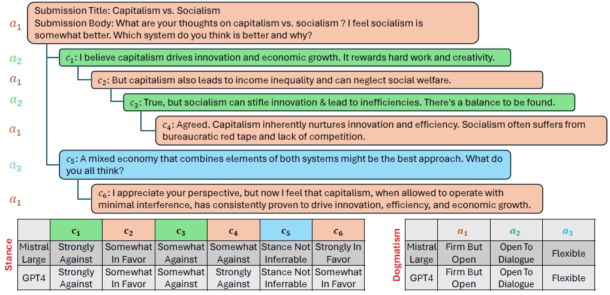

# USDC: A Dataset of <ins>U</ins>ser <ins>S</ins>tance and <ins>D</ins>ogmatism in Long <ins>C</ins>onversations 

[USDC: A Dataset of <ins>U</ins>ser <ins>S</ins>tance and <ins>D</ins>ogmatism in Long <ins>C</ins>onversations], Arxiv-2024



# To Download the Dataset
``` bash
pip install data -> just example
```


## USDC Dataset Folder Details
This folder contains the USDC stance and dogmatism datasets. Stance is at post level and given for each comment of the user. Dogmatism is at user level and given for entire user conversation.
There are two sub folders in this folder. The subfolder **"USDC Stance Data"** contains the "USDC_Stance.pkl" file that contains the information related to the stance classification data and corresponding LLM generated annotations (({Mistral Large, GPT-4}×{zero-shot, one-shot, few-shot})), the training_stance.pkl file contains the training data and testing_stance.pkl file contains the testing data for Stance classification. 

**The columns in USDC_Stance.pkl file are as follows:**
- **Submission_id** is the unique identifier of the Reddit conversation
- **Subreddit** is the topic name of a Reddit conversation (Eg: Abortion, Guncontrol and so on) 
- **title** is the first post in a Reddit conversation and called as submission post title
- **content** is the description of title, also called as submission body or content
- **reddit_link** is the link to the entire conversation
- **comments** are the nested replies to the submission
- **author_key** is the unique author identification (in USDC dataset, it tells about author1 or author 2 id's)
- **stance_id** is the unique identifier of the comment
- **gpt41106preview_zero_shot_stance_label** contains the Stance annotations generated using GPT-4 zero shot prompting
- **gpt41106preview_zero_shot_stance_reason** contains the reasons/justifications for selecting the stance label and is generated using GPT-4 zero shot prompting
- **gpt41106preview_one_shot_stance_label** contains the Stance annotations generated using GPT-4 one shot prompting
- **gpt41106preview_one_shot_stance_reason** contains the reasons/justifications for selecting the stance label and is generated using GPT-4 one shot prompting
- **gpt41106preview_few_shot_stance_label** contains the Stance annotations generated using GPT-4 few shot prompting
- **gpt41106preview_few_shot_stance_reason** contains the reasons/justifications for selecting the stance label and is generated using GPT-4 few shot prompting
- **mistrallargelatest_zero_shot_stance_label** contains the Stance annotations generated using Mistral Large zero shot prompting
- **mistrallargelatest_zero_shot_stance_reason** contains the reasons/justifications for selecting the stance label and is generated using Mistral Large zero shot prompting
- **mistrallargelatest_one_shot_stance_label** contains the Stance annotations generated using Mistral Large one shot prompting
- **mistrallargelatest_one_shot_stance_reason** contains the reasons/justifications for selecting the stance label and is generated using Mistral Large one shot prompting
- **mistrallargelatest_few_shot_stance_label** contains the Stance annotations generated using Mistral Large few shot prompting
- **mistrallargelatest_few_shot_stance_reason** contains the reasons/justifications for selecting the stance label and is generated using Mistral Large few shot prompting
- **author_key_name** contains the corresponding author name of the author key
- **stance_id_timestamp** contains timestamp of the comment/submission
- **stance_id_comment** contains textual content of the stance id (per message)
- **author_names** contains the meta data of selected two author names for a submission id
- **author_id_details** contains the metadata of selected two author comments count and ids of the comments
- **majority_vote_stance_label** contains final gold label that we selected using majority voting for stance classification

The "USDC Dogmatism Data" sub folder contains the information related to the dogmatism data, corresponding LLM annotations and the training and testing data for Dogmatism classification. The subfolder **"USDC Stance Data"** contains the "USDC_Dogmatism.pkl" file that contains the information related to the Dogmatism classification data and corresponding LLM generated annotations (({Mistral Large, GPT-4}×{zero-shot, one-shot, few-shot})), the training_stance.pkl file contains the training data and testing_stance.pkl file contains the testing data for Dogmatism classification. 

**The columns in USDC_Dogmatism.pkl file are as follows:**
- **Submission_id** is the unique identifier of the Reddit conversation
- **Subreddit** is the topic name of a Reddit conversation (Eg: Abortion, Guncontrol and so on)
- **title** is the first post in a Reddit conversation and called as submission post title
- **content** is the description of title, also called as submission body or content
- **reddit_link** is the link to the entire conversation
- **comments** are the nested replies to the submission
- **author_key** is the unique author identification (in USDC dataset, it tells about author1 or author 2 id's)
- **gpt41106preview_zero_shot_dogmatism_label** contains the Dogmatism annotations generated using GPT-4 zero shot prompting
- **gpt41106preview_zero_shot_dogmatism_reason** contains the reasons/justifications for selecting the Dogmatism label and is generated using GPT-4 zero shot prompting
- **gpt41106preview_one_shot_dogmatism_label** contains the Dogmatism annotations generated using GPT-4 one shot prompting
- **gpt41106preview_one_shot_dogmatism_reason** contains the reasons/justifications for selecting the Dogmatism label and is generated using GPT-4 one shot prompting
- **gpt41106preview_few_shot_dogmatism_label** contains the Dogmatism annotations generated using GPT-4 few shot prompting
- **gpt41106preview_few_shot_dogmatism_reason** contains the reasons/justifications for selecting the Dogmatism label and is generated using GPT-4 few shot prompting
- **mistrallargelatest_zero_shot_dogmatism_label** contains the Dogmatism annotations generated using Mistral Large zero shot prompting
- **mistrallargelatest_zero_shot_dogmatism_reason** contains the reasons/justifications for selecting the Dogmatism label and is generated using Mistral Large zero shot prompting
- **mistrallargelatest_one_shot_dogmatism_label** contains the Dogmatism annotations generated using Mistral Large one shot prompting
- **mistrallargelatest_one_shot_dogmatism_reason** contains the reasons/justifications for selecting the Dogmatism label and is generated using Mistral Large one shot prompting
- **mistrallargelatest_few_shot_dogmatism_label** contains the Dogmatism annotations generated using Mistral Large few shot prompting
- **mistrallargelatest_few_shot_dogmatism_reason** contains the reasons/justifications for selecting the Dogmatism label and is generated using Mistral Large few shot prompting
- **majority_vote_dogmatism_label** contains final gold label that we selected using majority voting for Dogmatism classification

## SLMs Finetuning Code
The folder "SLMs Finetuning Code" contains the code notebooks related to three pretrained small language models (LLaMA-2-7B, LLaMA-3-8B, Falcon-7B) and four instruction-tuned small language models (LLaMA-2-chat-7B, LLaMA-3-8B-instruct, Vicuna-7B-v.1.5, and Falcon-7B-instruct).

## SLMs Instruction-tuning Code
The folder "SLMs Instruction-tuning Code" contains the code notebooks related to three pretrained small language models (LLaMA-2-7B, LLaMA-3-8B, Falcon-7B) and four instruction-tuned small language models (LLaMA-2-chat-7B, LLaMA-3-8B-instruct, Vicuna-7B-v.1.5, and Falcon-7B-instruct).

## LLM Annotations Code
The folder "LLM Annotations Code" contains the code notebooks related to Mistral Large zero-shot, Mistral Large one-shot, Mistral Large few-shot, GPT-4 zero-shot, GPT-4 one-shot, GPT-4 few-shot. Alos, the system prompt of zero-shot, one-shot, few-shot.

## Human Survey
The folder "Human Survey" contains the information related to the human survey.


